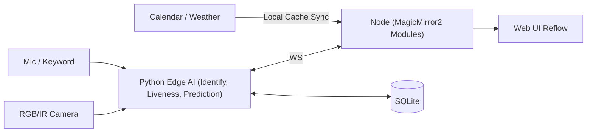
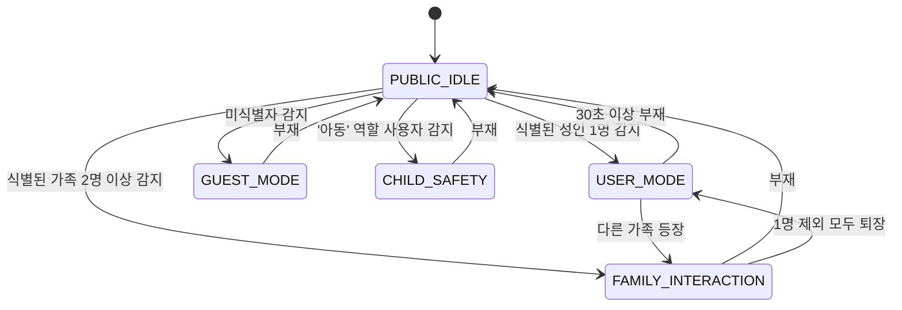

# SmartMirror Aura — 상황인지 기반 지능형 미러 

**온디바이스 패턴 학습**으로 **다음 행동을 예측**해 UI를 **사전 재배치/선로딩**하고, **역할·권한·상황 정책**으로 **상황에 따른 다양한 모드**를 제공하는 스마트 미러.

> Badges: `Edge-Only Inference` · `Privacy-First` · `MagicMirror² + Node` · `Python Pipeline` · `SQLite Local Logs` · `Generative Layout Engine`

---

## Table of Contents

* [프로젝트 개요 및 핵심 가치](#프로젝트-개요-및-핵심-가치) · [Target Users](#target-users) · [가치 제안](#가치-제안)
* [작품의 주요 차별점](#작품의-주요-차별점)
* [특허 리서치 & 전략](#특허-리서치--전략-patent-landscape--strategy)
* [시장 조사 스냅샷](#시장-조사-스냅샷-Market-Sizing-Snapshot)
* [시스템 아키텍처](#시스템-아키텍처) · [상태/세션 모델](#상태세션-모델) · [데이터 흐름](#데이터-흐름)
* [핵심 기능 & 사용자 스토리](#핵심-기능--사용자-스토리)
* [성능 목표](#성능-목표) · [QA/테스트 플랜](#qatest-플랜) · [측정 지표](#측정-지표)
* [보안/프라이버시/윤리](#보안프라이버시윤리)
* [설치/빌드/배포(라즈베리파이)](#설치빌드배포라즈베리파이) · [트러블슈팅](#트러블슈팅)
* [로드맵](#로드맵) · [기여 가이드](#기여-가이드) · [라이선스](#라이선스) · [팀](#팀) · [변경 이력](#변경-이력)
* [FAQ](#faq)
* [Assumptions & Future Work](#assumptions--future-work)

---

## 프로젝트 개요 및 핵심 가치

#### **"당신의 습관을 기억하고, 상황에 맞춰 스스로 변하는 거울"**

**Aura**는 단순 정보 나열을 넘어, 사용자의 상태(State)와 과거 습관(History)을 이해하여 **온디바이스(Edge)에서 다음 행동을 예측**하고 화면을 **사전 재배치/선로딩**하는 지능형 스마트 미러입니다. 얼굴/음성·시간대·최근 7일 사용 패턴(머문 시간·선호 위젯·세션 길이)을 로컬에서 학습해 **네트워크와 무관하게 빠르고 일관된 응답**을 제공합니다. 사용자가 자리를 비우면 자동으로 **상황에 따른 다양한 모드**로 전환되어 **메모/음성 남기기·합성 캘린더 요약·도어벨/현관 카메라 티커·게스트 프라이버시 배너**를 띄우고, 다시 사용자가 나타나면 **세션 복원**과 함께 가장 필요할 정보를 상단에 배치합니다.

### 우리가 해결하려는 문제:

기존 스마트 디스플레이와 미러는 **정적 ui로만으로 구성되어서 정보 처리가 비효율적이다**라는 명확한 한계를 가집니다.

-   **고객의 애로사항 (Pain Points)**:
      예를들어, 기존 **MagicMirror²** 기반의 DIY 제품들은 모든 사용자에게 고정된 위젯 목록을 보여주어, 아침 출근 준비로 바쁜 아빠에게 **아무 관련 없는 아이의 숙제 알림까지 노출하는 비효율**을 낳습니다.

결론적으로, 이들은 사용자의 '현재 상황'과 '과거 습관'을 이해하지 못하여, 적절한 순간에 적절한 정보를 제공하는 데 실패하고 있습니다.

### 우리의 해결책: 패턴 학습 예측 기능과 상황인지 오케스트레이터 기능의 결합

Aura는 **패턴 학습 예측 기능**과 **상황인지 오케스트레이터 기능**를 결합하여 이 문제를 해결합니다. 시스템은 항상 아래의 상태 중 하나로 존재하며, 상황 변화에 따라 스스로 역할을 바꿉니다.

**1. 패턴 학습 예측 기능: 당신의 습관을 기억하는 비서**
-   **동작**: 특정 사용자가 식별되면, 시스템은 해당 사용자의 **'개인 비서 모드'**로 동작합니다.
-   **기능**:
    -   **예측형 개인화**: "A님은 아침 8시에 날씨 위젯을 가장 먼저 본다"는 과거 이력을 학습하여, 다음 날 아침에 날씨 위젯을 가장 잘 보이는 곳으로 **미리 재배치**하고 데이터를 **선로딩**합니다.
    -   **세션 메모리 그래프**: 사용자가 잠시 자리를 비웠다가 다시 돌아왔을 때, 이전에 보던 정보의 맥락(예: 캘린더의 특정 이벤트)을 기억하고 바로 **이어서 보여줍니다.**

**2. 상황인지 오케스트레이터 (Context-Aware Orchestrator)**
-   **동작**: 특정 사용자가 혼자 있거나, 여러 명이 있거나, 방문객이 있는 등 **실시간 상황을 인지**하여, 시스템은 다음과 같이 각기 다른 모드로 스스로 역할을 전환합니다.
-   **기능**:
    -   **`USER_MODE` (개인 비서 모드: "학습형 개인 비서")**: 식별된 사용자 **한 명**이 감지되면, 해당 사용자의 과거 이력을 학습하여 **가장 필요할 정보를 예측하고 UI를 동적으로 재구성**하는 핵심 개인화 모드로 동작합니다. 개인 캘린더, 세션 복원 등의 기능이 활성화됩니다.
    -   **`PUBLIC_IDLE` (기본 공용 모드: "고요한 정보의 흐름")**: **아무도 없을 때**는, 가족 공유 사진첩이나 미니멀한 시계/날씨 정보를 표시하여 공간을 '살아있는' 디지털 액자로 만듭니다.
    -   **`GUEST_MODE` (게스트 모드: "프라이버시를 존중하는 안내자")**: **식별되지 않은 방문객**이 감지되면, 모든 개인정보를 즉시 숨기고 환영 메시지나 Wi-Fi 정보 등 게스트에게 필요한 정보만 표시합니다.
    -   **`FAMILY_INTERACTION` (가족 상호작용 모드: "소통과 조율의 중심")**: **두 명 이상의 가족**이 함께 있을 땐, 각자의 캘린더를 하나의 시간표로 합쳐 보여주거나, 화면을 분할하여 각자에게 필요한 정보를 동시에 제공합니다.
    -   **`CHILD_SAFETY` (아동 안전 모드: "아이를 위한 안전한 가이드")**: **'아동'으로 등록된 사용자**가 감지되면, 유해하거나 불필요한 정보(예: 주식, 업무 일정)를 자동으로 필터링합니다.
    -   (*모든 모드는 `ALERT_MODE`에 의해 중단될 수 있습니다. 예: 스마트 초인종이 울리면 즉시 현관 카메라 화면으로 전환*)
      
**요약**: Aura는 *클라우드 변화에 반응하는 화면*이 아니라, **“왜 지금 그 카드가 거기에 있는가”를 온디바이스에서 결정하는 예측 엔진**과, **잠금화면이 아닌 역할·상황 정책으로 움직이는 상황인지 모드**로 **빠름·안정·프라이버시 가치**를 동시에 달성합니다.

## Target Users

* 자녀가 있는 가정, 1–2인 가구, 코리빙 하우스, 스튜디오/오피스 리셉션.

## 가치 제안

* **빠름/안정**: 오프라인 내성 + 예측형 선로딩.
* **안심**: 로컬 학습·로깅, 외부 전송은 익명 집계.
* **상황 인지**: 역할/권한/상황 중심의 **정책 오케스트레이션**.

---

## 작품의 주요 차별점

### 1) **패턴 학습 예측 기능** 

* **기존 클라우드형과의 핵심 차이**: *클라우드형*은 외부 콘텐츠 변화가 **트리거**이고, *Aura*는 **사용자 맥락**(등장/시간대/최근 7일 이력)에서 **다음 행동 확률**을 추정해 **레이아웃을 선재배치**·**데이터 선로딩**.
* **아키텍처 차이**: 의사결정이 \*\*엣지(로컬)\*\*에서 이뤄져 **지연 결정성**, **오프라인 내성**, **프라이버시**가 구조적으로 다름.
* **검증 지표**: *Time-to-Info 30%↓*, *탭 수 25%↓*, *시선 전환 20%↓*, *프리페치 히트율↑*, *레이아웃 변동률≤0.3/세션*.

| 구분        | 클라우드 변화 반응형    | Aura 예측형 (온디바이스)                                       |
| --------- | -------------- | ------------------------------------------------------ |
| Trigger   | 외부 피드 갱신       | 사용자 등장/시간대/이력 기반 **행동 예측**                             |
| Data Path | Cloud→API→UI   | Cam/Voice→Edge Inference→SQLite→**Priority Policy**→UI |
| Decision  | 규칙 기반 노출       | **밴딧/베이지안** + **히스테리시스**                               |
| UX 지각     | 신선하나 맥락 불일치 가능 | **필요한 것의 사전 배치/선로딩**                                   |
| Latency   | 네트워크 영향 큼      | **엣지 응답** (오프라인 내성)                                    |
| Privacy   | 개인화 시 서버 의존    | **로컬 학습**, 외부는 **익명 집계만**                              |
| Fail Mode | API 지연/빈칸      | 오탐 시 **안전 레이아웃 폴백**                                    |

### 2) 상황인지 오케스트레이터 (Context-Aware Orchestrator)

#### 핵심 철학: 정적 디스플레이에서 '상황인지 오케스트레이터'로
기존 제품의 UI가 고정되어 있는 것과 달리, 저희 'Aura'는 **'누가, 무엇을, 어떤 상황에서'** 보는지를 종합적으로 인지하여, 정보의 노출과 상호작용을 지능적으로 지휘하는 **'오케스트레이터(Orchestrator)'** 역할을 수행합니다. 이를 위해 시스템은 항상 아래의 상태 중 하나로 존재하며, 상황 변화에 따라 스스로 역할을 바꿉니다.

#### 1. 상태 정의 및 전환 기준 (State Definition & Transition Criteria)
'Aura'의 상태는 다음과 같이 구체적으로 세분화되고, 명확한 기준(Criteria)에 따라 전환됩니다.

| 상태 (State) | 전환 기준 (Transition Criteria) |
| :--- | :--- |
| **1. `USER_MODE`** (개인 비서 모드) | - 식별된 '성인' 역할의 가족 구성원 **1명만** 감지됨 |
| **2. `PUBLIC_IDLE`** (기본 공용 모드) | - 마지막으로 식별된 사용자가 30초 이상 부재 - 특별한 외부 이벤트 없음 |
| **3. `GUEST_MODE`** (게스트 모드) | - 식별되지 않은(Unknown) 얼굴이 5초 이상 감지됨 |
| **4. `FAMILY_INTERACTION`** (가족 상호작용 모드) | - 식별된 가족 구성원 **2명 이상**이 동시에 감지됨 |
| **5. `CHILD_SAFETY`** (아동 안전 모드) | - '아동' 역할(Role)로 등록된 사용자가 단독으로 또는 함께 감지됨 |
| **6. `ALERT_MODE`** (경고/이벤트 모드) | - 스마트 초인종, 심각 등급의 공유 캘린더 알림 등 외부 이벤트 발생 시 |

#### 2. 상태별 기능 상세 구현
각 상태에 따라 'Aura'는 다음과 같이 역할과 기능을 동적으로 변경합니다.

**`USER_MODE` 상태: "학습형 개인 비서"**
이것이 'Aura'의 가장 핵심적인 개인화 모드입니다.
* **예측형 개인화**: "A님은 아침 8시에 날씨 위젯을 가장 먼저 본다"는 과거 이력을 학습하여, 다음 날 아침에 날씨 위젯을 가장 잘 보이는 곳으로 **미리 재배치**하고 데이터를 **선로딩**합니다.
* **세션 메모리 그래프**: 사용자가 잠시 자리를 비웠다가 다시 돌아왔을 때, 이전에 보던 정보의 맥락(예: 캘린더의 특정 이벤트)을 기억하고 바로 **이어서 보여줍니다.**
* **개인 맞춤 정보 로딩**: 해당 사용자의 개인 캘린더, 업무용 뉴스 피드, 개인 메모 등 **개인에게만 해당하는 정보**를 불러옵니다.

**`PUBLIC_IDLE` 상태: "고요한 정보의 흐름"**
아무도 없을 때, 공간을 살아있는 디지털 액자로 만듭니다.
* **디지털 액자**: 가족 공유 앨범의 사진들을 부드러운 전환 효과와 함께 슬라이드쇼로 보여줍니다.
* **미니멀 정보**: 화면 한쪽에 아날로그 스타일의 시계와 현재 날씨 아이콘만 미니멀하게 표시합니다.
* **가족 메모**: 가족 구성원이 남긴 고정 메모(예: "내일 재활용 버리는 날!")를 하단에 표시합니다.

**`GUEST_MODE` 상태: "프라이버시를 존중하는 안내자"**
방문객을 감지하면 프라이버시 보호를 최우선으로 작동합니다.
* **프라이버시 배너**: "Welcome! 개인정보 보호를 위해 게스트 모드로 표시 중입니다." 와 같은 안내 문구를 상단에 표시합니다.
* **개인정보 마스킹**: 모든 개인 캘린더, 뉴스 피드, 사진첩 등을 즉시 숨김 처리합니다.
* **게스트용 정보**: 집의 Wi-Fi 비밀번호, 환영 메시지 등을 표시합니다.
* **메시지 남기기**: 방문객이 가족에게 음성 또는 텍스트 메모를 남길 수 있는 기능을 활성화합니다.

**`FAMILY_INTERACTION` 상태: "소통과 조율의 중심"**
여러 가족 구성원이 함께 있을 때, 정보의 충돌을 해결하고 소통을 돕습니다.
* **합성 캘린더 요약 (Synthetic Calendar Summary)**: 아빠의 개인 일정과 엄마의 개인 일정을 합쳐, "오늘 저녁 6시: 아빠(저녁 약속), 엄마(요가 수업)" 와 같이 시간대별로 재구성하여 요약해줍니다.
* **공정성 분할/로테이션 (Fairness Resolver)**: 아빠의 '긴급 업무 알림'과 엄마의 '쇼핑 리스트'가 동시에 있을 경우, 중요도에 따라 화면을 7:3으로 분할하거나, 10초마다 각자의 핵심 정보를 번갈아 보여주는 정책을 실행합니다.

**`CHILD_SAFETY` 상태: "아이를 위한 안전한 가이드"**
아이가 감지되면 유해하거나 불필요한 정보를 차단하고, 긍정적인 상호작용을 유도합니다.
* **콘텐츠 필터링**: 주식, 복잡한 뉴스, 부모님의 업무 일정 등 아이에게 불필요한 위젯을 자동으로 숨깁니다.
* **아이 맞춤 위젯**: 오늘의 학교 준비물, 숙제 리마인더, 칭찬 스티커 보드 등 아이 눈높이에 맞는 정보를 우선적으로 보여줍니다.

**`ALERT_MODE` 상태: "가장 중요한 정보의 전달자"**
다른 모든 상태를 일시적으로 중단시키고, 가장 시급한 정보를 전달합니다.
* **전체 화면 전환**: 스마트 초인종이 울리면, 10초간 현관 카메라 영상을 전체 화면으로 보여줍니다.
* **긴급 배너**: '1시간 뒤 제주도행 비행기' 같은 중요한 공유 일정이 있다면, 화면 최상단에 붉은색 배너로 강조하여 표시합니다.
  

| 항목     | 일반 스마트미러(잠금/위젯 고정) | **Project Aura**               |
| ------ | ------------------ | ------------------------------ |
| 개인화 방식 | 서버/규칙 중심, 변동성 ↑    | **온디바이스 예측** + **레이아웃 생성**     |
| 공용 모드  | 배경/슬라이드쇼           | **역할·권한·상황 정책 레이어**            |
| 프라이버시  | 계정 동기화 의존          | **로컬 잔류**(+익명 통계 전송만)          |
| 다인 동시성 | 미지원/수동 전환          | **Fairness Resolver**로 분할/로테이션 |
| 실패 폴백  | 빈칸/지연              | **안전 레이아웃**·로컬 캐시              |
| 검증 지표  | 체류시간/클릭            | **TTI/탭/시선·복원률·히트율** 중심        |
---

## 특허 리서치 & 전략 (Patent Landscape & Strategy)

> **요지**: 선행 특허들은 대부분 **하드웨어 통합(하프미러/센서)** 또는 **단순 인식(포즈/생체정보)**에 집중합니다. **Aura의 독창성은 "온디바이스 예측 엔진 + Generative Layout + 역할·권한·상황 정책"이라는 '결정·정책 레이어'에 있습니다.**

### 1) 대표 특허 맵
| 구분 | 출원/번호 | 핵심 청구항/아이디어(요지) | Aura와의 차별점(독창성 포인트) |
| :--- | :--- | :--- | :--- |
| A | **US 10,052,026 B1** | 멀티스펙트럼 3D 카메라와 디스플레이를 통합한 **스마트 미러 하드웨어/시스템**. | **하드웨어 통합** 중심. Aura는 **온디바이스 행동 예측·Generative Layout·공용 정책 오케스트레이션**에 독창성 초점. |
| B | **US 10,810,912 B2** | 거울 주변 **LED 링 조명/상태 표시**와 카메라를 이용한 상호작용·조명 보정. | 광학/조명 HCI 특허. Aura는 **확률적 우선순위+선로딩**과 **정책 기반 공용 모드**가 핵심. |
| C | **US 10,318,145 B2** | **하프미러 + 디스플레이** 결합 구조와 인터랙티브 표시. | **디스플레이-거울 구조** 중심. Aura는 **레이아웃 생성 엔진·세션 메모리 그래프**로 기능 차별. |

### 2) FTO(자유실시) 및 권리화 전략
* **회피·차별 포인트**: ①의사결정/개인화가 **엣지**에서 수행, ②**레이아웃을 동적으로 생성**하는 파이프라인, ③**역할·권한·상황 기반 정책 전이** 및 공정성 스케줄링.
* **권고**: 위 세 가지 포인트를 결합한 **"상황인지 기반 동적 UI 생성 및 정책 관리 시스템"**으로 프로비저널 출원(가출원) 준비.

---
## 시장 조사 스냅샷 (Market Sizing Snapshot)

### 1) 스마트 미러 시장: 꾸준한 성장세

여러 시장 조사 기관에 따르면, 전 세계 스마트 미러 시장은 2024년 약 1~2조 원 규모이며, 앞으로 **연평균 성장률(CAGR)이 8%에서 12%정도**에 이를 것으로 예측됩니다. (CAGR은 복리 이자처럼, 매년 평균적으로 이만큼씩 꾸준히 성장한다는 의미입니다.)

특히, 가정집에서 벽에 거는 제품이 시장의 대부분을 차지하고 있으며, 우리나라가 포함된 **아시아-태평양(APAC) 지역**의 성장 가능성이 높게 평가되고 있습니다.

### 2) 인접 시장: 더 큰 잠재력

우리 제품은 '거울'이기도 하지만, 정보를 보여주는 '스마트 디스플레이'이기도 합니다. 이 스마트 디스플레이 시장은 스마트 미러 시장보다 훨씬 커서, 2024년 기준 약 10조 원이 넘고, 연평균 성장률도 20% 이상으로 매우 가파릅니다.

이는 우리 제품이 단순한 '거울' 시장에만 머무는 것이 아니라, 훨씬 더 큰 '스마트 디스플레이' 시장의 수요까지 흡수할 수 있다는 잠재력을 보여줍니다.

### 3) 시장 기회 및 우리의 전략

* **수요처 확대**: 최근에는 집과 사무실, 상업 공간의 경계가 허물어지는 **'리조머셜(Resimercial)' 트렌드**가 뜨고 있습니다. 덕분에 저희 제품도 가정집 현관을 넘어, **호텔 로비, 피트니스 센터, 회사 리셉션** 등 새로운 공간으로 확장할 기회가 많습니다.

* **제품 차별화**: 저희는 '디자인이 예쁜 거울'이라는 하드웨어 경쟁에서 벗어나고자 합니다. 대신, **사용자의 습관을 예측하는 똑똑한 소프트웨어**와 **개인정보를 안전하게 지키는 로컬 AI**라는 핵심 가치를 통해 기술적으로 차별화된 제품을 선보일 것입니다.

* **초기 목표 설정**: 처음에는 기술에 관심 많은 **1~2인 가구나 신혼부부**를 중심으로 시작하여, 저희 제품의 '공용 모드' 가치가 빛을 발할 수 있는 **숙박업소나 오피스** 같은 기업용(B2B) 시장으로 점차 확대해 나갈 계획입니다.

### 4) 구체적인 목표 지표

* **기술 검증(PoC) 단계 목표**: 제품의 초기 버전이 완성되면, **"현관에서 30초 안에 외출에 필요한 정보의 90% 이상을 전달"**하고, **"개인정보 노출 사고 0건"**을 달성하는 것을 1차 목표로 삼습니다.

* **사업화 단계 목표**: 제품이 시장에 출시되면, 우리가 실제로 공략 가능한 시장(SAM)에서 **일정 비율 이상의 고객을 확보**하는 것을 장기적인 목표로 설정합니다.
  
---

## 시스템 아키텍처

### 상태/세션 모델

### 데이터 흐름

1. **Cam/Mic 입력** → Python이 **Identify/Liveness** + **Context Features** 계산
2. Python이 **Priority Policy**로 **위젯 점수** 산출 → **Layout Suggest** 송신(WS)
3. Node/MagicMirror²가 **Reflow**·**Prefetch** → UI 반영
4. **Interactions**(click/dwell/voice) 로깅 → SQLite → 정책 업데이트

---

## 핵심 기능 & 사용자 스토리

### 1. Generative Layout Engine (생성형 레이아웃 엔진)

* **개념**: 미리 정해진 템플릿에 정보를 표시하는 것이 아니라, 사용자의 실시간 맥락과 과거 이력 데이터를 바탕으로 **최적의 UI 레이아웃을 동적으로 '생성'하는 시스템**입니다.
* **동작 방식**:
    1.  `Priority Policy` 알고리즘이 각 위젯(날씨, 캘린더 등)의 현재 중요도를 0~100점 사이의 **'우선순위 점수'**로 계산합니다.
    2.  `Layout Generation` 알고리즘은 이 점수를 입력받아, 각 위젯에 `크기(xs/s/m/l)`, `화면상 위치(그리드 좌표)`, `강조 효과(색상, 테두리)` 등 시각적 속성을 동적으로 할당하여 최종 레이아웃을 결정합니다.
* **기대 효과**: 사용자가 정보를 찾아다니는 것이 아니라, **가장 필요한 정보가 가장 중요한 위치에 스스로 나타나게** 함으로써, 정보 탐색 비용을 최소화하고 '나를 이해하는' 듯한 UX를 제공합니다.

### 2. Predictive Pre-Emption (예측적 선점/선로딩)

* **개념**: 사용자가 특정 위젯을 보거나 터치하기 **'전'**에, 그 행동을 미리 예측하여 필요한 데이터를 **백그라운드에서 먼저 불러오는** 성능 최적화 기술입니다.
* **동작 방식**:
    1.  `Priority Policy`가 예측한 '상위 3개 예상 선호 위젯' 목록을 시스템에 전달합니다.
    2.  시스템은 이 목록을 바탕으로, 해당 위젯들이 필요로 하는 외부 API(날씨, 뉴스 등)를 미리 호출하여 데이터를 로컬 캐시에 저장해 둡니다.
* **기대 효과**: 사용자가 실제로 위젯을 눌러 상세 정보를 확인할 때, 이미 데이터가 준비되어 있으므로 **네트워크 지연(Latency) 없이 즉각적으로 화면이 반응**합니다. 이는 전체 시스템의 체감 속도를 극대화시키는 핵심적인 역할을 합니다.

### 3. Session Memory Graph (세션 메모리 그래프)

* **개념**: 사용자의 단기적인 작업 맥락을 기억하는 **'단기 기억' 시스템**입니다.
* **동작 방식**:
    1.  사용자가 특정 위젯과 상호작용(예: 캘린더에서 'A 회의' 상세 보기)하면, 이 상태를 `(UserID, last_widget, state)` 형태로 시스템 메모리에 기록합니다.
    2.  사용자가 잠시 자리를 비웠다가(예: 1분 이내) 다시 돌아오면, 시스템은 이 '마지막 상태'를 확인합니다.
    3.  일반적인 개인화 화면을 보여주는 대신, 기억해 둔 'A 회의 상세 보기' 화면을 즉시 복원하여 사용자가 하던 작업을 끊김 없이 이어갈 수 있게 합니다.
* **기대 효과**: 사용자의 반복적인 조작을 줄여주고, 미러가 마치 사용자의 생각을 기억하는 것처럼 느껴지게 하여 매끄러운 사용자 경험을 제공합니다.

### 4. Roleful Public Mode (역할 기반 공용 모드)

* **개념**: 이전에 우리가 '상황인지 오케스트레이터'로 정의한 시스템의 사용자향 기능명입니다. **사용자의 역할(Role)과 상황에 따라** 거울의 기능과 정보 노출 범위를 정책적으로 제어하는 시스템 전체를 의미합니다.
* **동작 방식**:
    1.  AI 서버가 사용자의 신원(Owner/Guest/Kid)과 수(1명/다수)를 실시간으로 파악합니다.
    2.  미리 정의된 정책에 따라, 해당 역할과 상황에 맞는 페르소나(UI 모드)로 자동 전환합니다. 예를 들어, 'Guest' 역할이 감지되면 'private' 태그가 붙은 모든 개인 위젯을 숨기고 'guest_banner' 위젯을 표시합니다.
* **기대 효과**: 공용 공간에 설치된 디바이스의 가장 큰 문제점인 **프라이버시와 정보 충돌 문제를 해결**하고, 모든 상황에서 모든 사용자에게 최적의 가치를 제공합니다.

### 5. Fairness Resolver (공정성 해결사)

* **개념**: 'Roleful Public Mode'의 하위 정책 중 하나로, **두 명 이상의 사용자가 동시에 존재할 때 발생하는 정보 노출 충돌을 해결**하기 위한 알고리즘입니다.
* **동작 방식**:
    1.  감지된 모든 사용자의 '우선순위 점수'와 '정보의 긴급도'(예: 10분 뒤 회의)를 입력받습니다.
    2.  미리 정의된 규칙(예: 긴급도 > 역할 우선순위 > 사용 시간)에 따라 **'다목적 스코어'**를 계산합니다.
    3.  최종 스코어에 따라, 화면을 동적으로 분할(7:3 등)하거나, 각 사용자의 최상위 정보를 10초마다 번갈아 보여주는(로테이션) 방식으로 정보를 공정하게 배분합니다.
* **기대 효과**: 다인 가족 환경에서도 특정 사용자에게만 정보가 편중되지 않고, **모두가 공평하게 필요한 정보를 얻을 수 있도록** 하여 갈등을 줄이고 만족도를 높입니다.

### 6. Privacy Budgeting (프라이버시 예산)

* **개념**: 사용자의 프라이버시를 보호하기 위해, **디바이스 외부로 나가는 데이터를 엄격하게 통제하고 관리**하는 시스템 정책입니다.
* **동작 방식**:
    1.  **로컬 데이터**: 얼굴 템플릿, 음성 원본, 상세 이용 기록 등 모든 개인 식별 정보(PII)는 **AES-GCM** 방식으로 암호화되어 디바이스 내부(SQLite)에만 저장됩니다.
    2.  **외부 전송**: 오직 제품 개선을 위한 통계 데이터만 외부로 전송될 수 있으며, 이때 각 데이터 항목별로 '프라이버시 예산(ε)'이 할당됩니다. 이 예산을 초과하는 민감한 정보 조합은 전송이 원천적으로 차단되며, 모든 데이터는 **개인을 알아볼 수 없도록 완벽하게 익명 처리된 집계(Aggregation) 형태**로만 전송됩니다.
* **기대 효과**: 'On-device AI'의 핵심 가치인 **프라이버시 보호**를 기술적으로 완벽하게 보장하여, 사용자에게 높은 수준의 신뢰를 제공합니다.
---

## 알고리즘/정책

* **Priority Policy**: 최근성(half-life) + 시간대 prior + 예상 세션 길이 + 다음 행동 확률 + 히스테리시스.
* **Layout Generation**: 점수→크기(xs/s/m/l)→그리드 패킹(선반형 shelf + first-fit) + **변화 임계값 θ**로 안정화.
* **Pre-Emption**: 상위 k 위젯 API 프리페치, 폰트·콘트라스트 **환경광 적응**.
* **Fairness**: 급박도(캘린더 임박/알림 심각도), 사용시간 공정성, 사전 합의 규칙(아동 보호) **다목적 스코어**.
* **Privacy**: 민감도 가중치·데이터 항목별 **전송 예산(ε)** 관리, 감사 로그.

---

## 성능 목표

* **Identify→UI 반응**: p95 < **250 ms** (로컬)
* **TTI**(상단 카드 첫 유효 정보): Baseline 대비 **-30%**
* **프리페치 히트율**: **≥ 0.6**
* **레이아웃 변동률**: **≤ 0.3/세션**
* **오탐/미탐 (liveness)**: **< 1% / < 2%**

## QA/Test 플랜

* **A/B**: A=클라우드 반응형, B=예측형(Generative+Pre-Emption)
* **현장 사용성**: SUS, NASA-TLX, 인터뷰(가족/게스트)
* **신뢰성**: 오프라인 30분 시나리오에서 기능 연속성
* **안전**: 게스트 마스킹 누락률 0% (감사 로그 확인)
* **리그레션**: 모듈별 단위/통합 테스트 + 로그 대시보드

## 측정 지표

* TTI, 탭 수, 시선 전환, 세션 복원률, 프리페치 히트율, 레이아웃 변동률, FPS/지연, 외부 전송 건수(개인 식별자 0), 오류/폴백율.

---

## 보안/프라이버시/윤리

* **온디바이스 우선**: 얼굴/음성 템플릿, 세션/인터랙션 로그 **AES-GCM** 암호화(디바이스 키링/TPM).
* **최소 데이터 이동**: 외부 전송은 **익명 집계 통계**만.
* **보존/삭제**: 기본(메모 30d, 음성 원본 7d, 방문자 1d), 즉시 삭제 가능 + **append-only 감사 로그**.
* **안티스푸핑**: IR + blinks/texture **liveness**.
* **아동 보호**: 금칙어/성인위젯 차단, 카메라 티커 마스킹.
* **설명가능성**: “상단 노출 이유” 툴팁(우선순위 근거).

---

## 설치/빌드/배포(라즈베리파이)

### 요구사항

* Raspberry Pi 5(또는 동급 x86 미니PC), CSI 카메라(RGB/IR), 마이크, 스피커(옵션).

### 1) OS & 패키지

### 2) Node & MagicMirror²

### 3) Aura Python 서비스

### 4) SQLite 초기화

### 5) 환경 변수

### 6) MagicMirror² 모듈 연결

### 7) 서비스 등록(systemd 예시)

---

## 트러블슈팅

---

## 로드맵

* **W1**: Presence/Identify/Liveness, DB 스키마, 기본 위젯 4종
* **W2**: Priority Policy v1, **Generative Layout** v1, Public Presets
* **W3**: **Predictive Pre-Emption**, **Session Memory Graph** v1
* **W4**: **Roleful Orchestrator**, **Fairness Resolver**, A/B 로깅

---

## 기여 가이드

* PR 전에 이슈 등록 → 재현 단계/로그 포함.
* 코딩 규약: Python(black), JS(ESLint).
* 보안 이슈는 공개 이슈 대신 **보안 메일**로 제보(Assumption).

---

## 라이선스

* **MIT** *(Assumption: 필요 시 변경 가능)*

---

## 팀

* Student PM/UX/Edge AI/Docs *(Assumption, 실명 비공개)*

---

## 변경 이력

* `v0.1.0` — 초기 MVP 스펙/스키마/정책 추가

---

## FAQ

**Q. 인터넷 없이도 동작하나요?**
A. 예. 핵심 의사결정/레이아웃/로그는 로컬만. 외부 동기화 불가 시 마지막 캐시 유지.

**Q. 게스트 앞에서 개인 정보가 뜨지 않나요?**
A. 기본 **게스트 마스킹** + **배너**. liveness 전까지 개인 위젯 잠금.

**Q. 아이들 사용은 안전한가요?**
A. 역할이 **kid**일 때 금칙 위젯 차단, 카메라 티커 마스킹.

**Q. 다인이 동시에 서면?**
A. **Fairness Resolver**가 분할/로테이션 및 우선권 점수를 적용.

**Q. 왜 클라우드 예측이 아닌 엣지 예측인가요?**
A. **지연 결정성/다인 실시간/프라이버시**를 동시에 만족하기 위해.

---

## Assumptions & Future Work

**Assumptions**

* HW: Raspberry Pi 5 + RGB/IR 카메라 + Mic (NPU 가용).
* 모델: 경량 얼굴 임베딩, 키워드 스폿팅, 헤드포즈 근사.
* 네트워크: 가정용 Wi-Fi, 간헐적 단절 허용.
* 캘린더/도어벨: 로컬 캐시/벤더 로컬 API 이용.

**Future Work**

* 멀티언어(ko/en/ja) 음성/텍스트 동시 지원.
* 모듈 마켓 샌드박스/권한 격리.
* 자기지도 학습으로 라벨링 최소화.
* 안드로이드/웹 뷰어 동기 세션.
* 에너지/발열 최적화 자동 스케일링.

