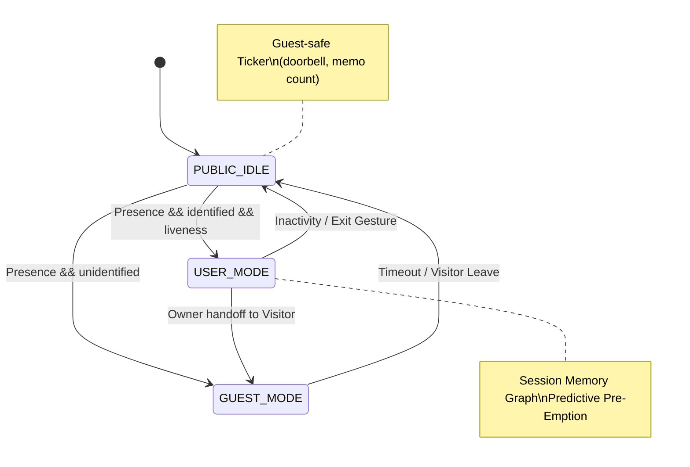

# Project Aura — 상황인지 기반 지능형 미러 (Edge AI)

**온디바이스 패턴 학습**으로 **다음 행동을 예측**해 UI를 **사전 재배치/선로딩**하고, **역할·권한·상황 정책**으로 가족이 함께 쓰는 **공용 모드**를 안전하게 오케스트레이션하는 스마트 미러.

> Badges: `Edge-Only Inference` · `Privacy-First` · `MagicMirror² + Node` · `Python Pipeline` · `SQLite Local Logs` · `Generative Layout Engine`

---

## Table of Contents

* [작품의 주요 차별점](#작품의-주요-차별점)
* [Problem & Opportunity](#problem--opportunity) · [Target Users](#target-users) · [가치 제안](#가치-제안)
* [특허 리서치 & 전략](#특허-리서치--전략-patent-landscape--strategy)
* [시장 조사 스냅샷](#시장-조사-스냅샷-market-sizing-snapshot)
* [선행 대비 차별점](#선행-대비-차별점)
* [시스템 아키텍처](#시스템-아키텍처) · [상태/세션 모델](#상태세션-모델) · [데이터 흐름](#데이터-흐름)
* [핵심 기능 & 사용자 스토리](#핵심-기능--사용자-스토리)
* [성능 목표](#성능-목표) · [QA/테스트 플랜](#qatest-플랜) · [측정 지표](#측정-지표)
* [보안/프라이버시/윤리](#보안프라이버시윤리)
* [설치/빌드/배포(라즈베리파이)](#설치빌드배포라즈베리파이) · [트러블슈팅](#트러블슈팅)
* [로드맵](#로드맵) · [기여 가이드](#기여-가이드) · [라이선스](#라이선스) · [팀](#팀) · [변경 이력](#변경-이력)
* [FAQ](#faq)
* [Assumptions & Future Work](#assumptions--future-work)

---

## 작품의 주요 차별점

### 1) **온디바이스 패턴 학습 예측형** 

* **클라우드형과의 핵심 차이**: *클라우드형*은 외부 콘텐츠 변화가 **트리거**이고, *Aura*는 **사용자 맥락**(등장/시간대/최근 7일 이력)에서 **다음 행동 확률**을 추정해 **레이아웃을 선재배치**·**데이터 선로딩**.
* **아키텍처 차이**: 의사결정이 \*\*엣지(로컬)\*\*에서 이뤄져 **지연 결정성**, **오프라인 내성**, **프라이버시**가 구조적으로 다름.
* **검증 지표**: *Time-to-Info 30%↓*, *탭 수 25%↓*, *시선 전환 20%↓*, *프리페치 히트율↑*, *레이아웃 변동률≤0.3/세션*.

| 구분        | 클라우드 변화 반응형    | Aura 예측형 (온디바이스)                                       |
| --------- | -------------- | ------------------------------------------------------ |
| Trigger   | 외부 피드 갱신       | 사용자 등장/시간대/이력 기반 **행동 예측**                             |
| Data Path | Cloud→API→UI   | Cam/Voice→Edge Inference→SQLite→**Priority Policy**→UI |
| Decision  | 규칙 기반 노출       | **밴딧/베이지안** + **히스테리시스**                               |
| UX 지각     | 신선하나 맥락 불일치 가능 | **필요한 것의 사전 배치/선로딩**                                   |
| Latency   | 네트워크 영향 큼      | **엣지 응답** (오프라인 내성)                                    |
| Privacy   | 개인화 시 서버 의존    | **로컬 학습**, 외부는 **익명 집계만**                              |
| Fail Mode | API 지연/빈칸      | 오탐 시 **안전 레이아웃 폴백**                                    |

### 2) **가족공용모드**

* **핵심 차이**: 기존 제품의 잠금/슬라이드쇼는 **정적 UI**, Aura의 **Roleful Public Mode**는 **역할·권한·상황**을 입력으로 **정책 레이어**가 **위젯 단위 접근제어/요약/행동 캡처**를 실행.
* **기능 묶음**: 가족 메모/음성 남기기, **합성 캘린더 요약**, 포토 리마인더, **도어벨/현관 카메라 티커**, **게스트 프라이버시 배너**, **아동 안전 모드**, **공정성 분할/로테이션**.
* **검증 지표**: **현관 30초 내 핵심정보 전달율 ≥90%**, **민감 정보 노출 0건**, **갈등 해결 시간↓**.

---

## Problem & Opportunity

* **문제**: 거실/현관에서 쓰는 스마트 미러는 **정적 대시보드**에 가깝고, 네트워크/클라우드 상태에 따라 **지연과 변동성**이 크며, **공용 사용 맥락**에서 **프라이버시/권한**이 미비.
* **기회**: **라즈베리파이5급 NPU**와 경량 모델, **온디바이스 개인화**가 실용화 → **예측형 UI**와 **역할·상황 정책**을 엣지에서 구현 가능.

## Target Users

* 자녀가 있는 가정, 1–2인 가구, 코리빙 하우스, 스튜디오/오피스 리셉션.

## 가치 제안

* **빠름/안정**: 오프라인 내성 + 예측형 선로딩.
* **안심**: 로컬 학습·로깅, 외부 전송은 익명 집계.
* **공용 가치**: 역할/권한/상황 중심의 **정책 오케스트레이션**.

---

## 특허 리서치 & 전략 (Patent Landscape & Strategy)

### 1) 대표 특허 맵(요지 요약)

| 구분 | 출원/번호                 | 핵심 청구항/아이디어(요지)                                                                            | Aura와의 차별점(독창성 포인트)                                                            |
| -- | --------------------- | ------------------------------------------------------------------------------------------ | ------------------------------------------------------------------------------ |
| A  | **US 10,052,026 B1**  | 멀티스펙트럼 3D 카메라(HD+IR)와 디스플레이를 통합한 **스마트 미러 하드웨어/시스템**. 센서→프로세서→미러 디스플레이 파이프라인. ([구글 특허][1]) | **하드웨어 통합** 중심. Aura는 **온디바이스 행동 예측·Generative Layout·공용 정책 오케스트레이션**에 독창성 초점. |
| B  | **US 10,810,912 B2**  | 거울 주변 **LED 링 조명/상태 표시**와 카메라를 이용한 상호작용·조명 보정. ([구글 특허][2])                                | 광학/조명 HCI 특허. Aura는 **확률적 우선순위+선로딩**과 **정책 기반 공용 모드**가 핵심.                     |
| C  | **US 10,318,145 B2**  | **하프미러 + 디스플레이** 결합 구조와 인터랙티브 표시. ([구글 특허][3])                                             | **디스플레이-거울 구조** 중심. Aura는 **레이아웃 생성 엔진·세션 메모리 그래프**로 기능 차별.                    |
| D  | **WO 2016/135183 A1** | **헤드/신체 포즈 추정**을 포함한 인터랙티브 미러(센서+프로세서). ([구글 특허][4])                                       | 포즈 인식 기반 인터랙션. Aura는 이를 **입력 특징**으로 쓰되, **예측·정책·공정성 분배**가 발명 포인트.              |
| E  | **US 10,845,511 B2**  | 바이오메트릭 센서를 포함한 거울, **사용자 생체정보 기반 상호작용**. ([portal.unifiedpatents.com][5])                  | 바이오센싱 초점. Aura는 **개인 데이터 로컬 잔류·예측형 UI**로 FTO 관점 차별.                            |

> **요지:** 선행은 대체로 **하드웨어 통합**(하프미러/조명/센서) 또는 **센싱/포즈/인식**에 집중되어 있습니다. **Aura의 독창성은 “온디바이스 예측 엔진 + Generative Layout + 역할·권한·상황 정책(공용 모드)”라는 **결정·정책 레이어**에 있습니다.**

### 2) FTO(자유실시) 관점 메모

* **회피·차별 포인트**

  * 의사결정/개인화가 **클라우드가 아니라 엣지**에서 수행되고, **레이아웃을 생성**(점수→크기/위치/강조)하는 **휴리스틱/밴딧+히스테리시스** 파이프라인.
  * **Roleful Public Mode**: 위젯 단위 접근 제어, 게스트 마스킹, 도어벨/방문자 이벤트에 따른 **정책 전이** 및 **공정성 스케줄링**.
* **권고:** **“예측형 레이아웃 생성”**, **“역할·권한·상황 정책 오케스트레이션”**, **“세션 메모리 그래프 기반 복원”**, \*\*“프라이버시 예산화(익명·집계 전송)”\*\*를 묶은 **프로비저널 출원**(claim skeleton) 준비.

### 3) 권리화 아이디어 스케치(요지)

* **청구항 예시(요지)**: “사용자 존재/시간대/세션 이력으로 계산된 **다음 행동 확률**에 따라, **위젯의 크기·위치·강조**를 **온디바이스에서 동적으로 생성**하고, \*\*공용 상황(방문자/도어벨/역할)\*\*에 따라 **노출 범위를 정책적으로 조정**하며, **세션 메모리 그래프**로 과업 상태를 복원하는 방법/장치.”

---

## 시장 조사 스냅샷 (Market Sizing Snapshot)

### 1) 스마트 미러(직접 시장)

* **Global Smart Mirror**

  * 2024년 **\~\$0.6B–\$1.8B** 추정: Precedence(2024: \$0.596B → 2034: \$1.30B, **CAGR \~8.1%**), GMInsights(2024: **\$1.8B**, 2034: \$6B, **CAGR \~12.9%**). ([Precedence Research][6], [Global Market Insights Inc.][7])
  * 2025→2035: **\$0.64B → \$1.38B, CAGR \~8%**(FMI). ([Future Market Insights][8])
  * (다수 보고서 공통) **주거용/월마운트 비중**이 큼, **APAC 성장성** 언급. ([Future Market Insights][8], [Precedence Research][6])

### 2) 인접 시장(스마트 디스플레이/보이스 디스플레이)

* **Smart Display(광의)**: 2024년 **\$9.22B → 2034년 \$59.38B**, **CAGR \~20.5%**(Precedence). ([Precedence Research][9])
* **Smart Display(타 추정)**: 2025년 **\$4.98B → 2033년 \$38.19B**, **CAGR \~29%**(Straits). ([Straits Research][10])
* **Voice-Assistant Displays**: 2025년 **\$4.2B**, 2024년 Alexa 점유율 **\~33.7%**(Mordor Intell.). ([Mordor Intelligence][11])

### 3) 시장 시사점 (Aura 관점)

* **수요 접점 확대**: 주거↔상업 경계가 흐려지는 **Resimercial(주거+상업 혼합) 트렌드**로 **현관/리셉션/피트니스/숙박** 등 **설치 포인트 확대**. ([AVNetwork][12])
* **제품 정의의 차별화**: “거울+표시” 하드웨어 경쟁에서 벗어나, **온디바이스 예측 UX + 역할 기반 공용 정책**으로 **설치 가치**와 **데이터 프라이버시**를 전면에.
* **초기 타깃(가정)**: 한국형 아파트·원룸·코리빙(현관/거실), **공용 모드 가치**가 즉시 체감되는 **숙박/피트니스/오피스 입구**로의 B2B 라이트.

### 4) 지표/목표(Go-To-Market 가설)

* **PoC KPI**: 설치 공간당 **현관 30초 내 핵심정보 전달율 ≥90%**, 민감 정보 노출 0건(감사 로그), 유지보수 요청/월 ≤ X.
* **상용화 KPI**: 인접 시장(스마트 디스플레이) 성장에 연동한 **Attachment Rate × 설치 포인트 수**로 **SAM** 산정.

---

## 선행 대비 차별점

| 항목     | 일반 스마트미러(잠금/위젯 고정) | **Project Aura**               |
| ------ | ------------------ | ------------------------------ |
| 개인화 방식 | 서버/규칙 중심, 변동성 ↑    | **온디바이스 예측** + **레이아웃 생성**     |
| 공용 모드  | 배경/슬라이드쇼           | **역할·권한·상황 정책 레이어**            |
| 프라이버시  | 계정 동기화 의존          | **로컬 잔류**(+익명 통계 전송만)          |
| 다인 동시성 | 미지원/수동 전환          | **Fairness Resolver**로 분할/로테이션 |
| 실패 폴백  | 빈칸/지연              | **안전 레이아웃**·로컬 캐시              |
| 검증 지표  | 체류시간/클릭            | **TTI/탭/시선·복원률·히트율** 중심        |

---

## 시스템 아키텍처

```mermaid
flowchart LR
  Cam[RGB/IR Camera] --> Py[Python Edge AI<br/>(Identify/Liveness, Prediction)]
  Mic[Mic/Keyword] --> Py
  Py <-->|WS| Node[Node/MagicMirror Modules]
  Py <--> DB[(SQLite)]
  Node --> UI[Web UI Reflow]
  Cloud[(Calendar/Weather)] -->|Local Cache Sync| Node
```

### 상태/세션 모델



### 데이터 흐름

1. **Cam/Mic 입력** → Python이 **Identify/Liveness** + **Context Features** 계산
2. Python이 **Priority Policy**로 **위젯 점수** 산출 → **Layout Suggest** 송신(WS)
3. Node/MagicMirror²가 **Reflow**·**Prefetch** → UI 반영
4. **Interactions**(click/dwell/voice) 로깅 → SQLite → 정책 업데이트

---

## 핵심 기능 & 사용자 스토리

* **Generative Layout Engine**: “출근 전 5분”에 우산/지하철/다음 일정이 **상단**에 크고 선명하게.
* **Predictive Pre-Emption**: 시선/터치 예상 상위 k 위젯 **프리페치**로 체감 지연 감소.
* **Session Memory Graph**: 현관에서 보던 **캘린더 헤드라인**을 거실에서 **자동 복원**.
* **Roleful Public Mode**: 방문자 앞에서는 **게스트 배너 + 개인 위젯 마스킹**.
* **Fairness Resolver**: 부모/아이 동시에 서면 **화면 분할** 또는 **시간 슬롯 로테이션**.
* **Privacy Budgeting**: 외부 전송은 **익명 통계**만, 로컬은 **AES-GCM** 암호화.

---

## 알고리즘/정책

* **Priority Policy**: 최근성(half-life) + 시간대 prior + 예상 세션 길이 + 다음 행동 확률 + 히스테리시스.
* **Layout Generation**: 점수→크기(xs/s/m/l)→그리드 패킹(선반형 shelf + first-fit) + **변화 임계값 θ**로 안정화.
* **Pre-Emption**: 상위 k 위젯 API 프리페치, 폰트·콘트라스트 **환경광 적응**.
* **Fairness**: 급박도(캘린더 임박/알림 심각도), 사용시간 공정성, 사전 합의 규칙(아동 보호) **다목적 스코어**.
* **Privacy**: 민감도 가중치·데이터 항목별 **전송 예산(ε)** 관리, 감사 로그.

---

## 성능 목표

* **Identify→UI 반응**: p95 < **250 ms** (로컬)
* **TTI**(상단 카드 첫 유효 정보): Baseline 대비 **-30%**
* **프리페치 히트율**: **≥ 0.6**
* **레이아웃 변동률**: **≤ 0.3/세션**
* **오탐/미탐 (liveness)**: **< 1% / < 2%**

## QA/Test 플랜

* **A/B**: A=클라우드 반응형, B=예측형(Generative+Pre-Emption)
* **현장 사용성**: SUS, NASA-TLX, 인터뷰(가족/게스트)
* **신뢰성**: 오프라인 30분 시나리오에서 기능 연속성
* **안전**: 게스트 마스킹 누락률 0% (감사 로그 확인)
* **리그레션**: 모듈별 단위/통합 테스트 + 로그 대시보드

## 측정 지표

* TTI, 탭 수, 시선 전환, 세션 복원률, 프리페치 히트율, 레이아웃 변동률, FPS/지연, 외부 전송 건수(개인 식별자 0), 오류/폴백율.

---

## 보안/프라이버시/윤리

* **온디바이스 우선**: 얼굴/음성 템플릿, 세션/인터랙션 로그 **AES-GCM** 암호화(디바이스 키링/TPM).
* **최소 데이터 이동**: 외부 전송은 **익명 집계 통계**만.
* **보존/삭제**: 기본(메모 30d, 음성 원본 7d, 방문자 1d), 즉시 삭제 가능 + **append-only 감사 로그**.
* **안티스푸핑**: IR + blinks/texture **liveness**.
* **아동 보호**: 금칙어/성인위젯 차단, 카메라 티커 마스킹.
* **설명가능성**: “상단 노출 이유” 툴팁(우선순위 근거).

---

## 설치/빌드/배포(라즈베리파이)

### 요구사항

* Raspberry Pi 5(또는 동급 x86 미니PC), CSI 카메라(RGB/IR), 마이크, 스피커(옵션).

### 1) OS & 패키지

### 2) Node & MagicMirror²

### 3) Aura Python 서비스

### 4) SQLite 초기화

### 5) 환경 변수

### 6) MagicMirror² 모듈 연결

### 7) 서비스 등록(systemd 예시)

---

## 트러블슈팅

---

## 로드맵

* **W1**: Presence/Identify/Liveness, DB 스키마, 기본 위젯 4종
* **W2**: Priority Policy v1, **Generative Layout** v1, Public Presets
* **W3**: **Predictive Pre-Emption**, **Session Memory Graph** v1
* **W4**: **Roleful Orchestrator**, **Fairness Resolver**, A/B 로깅

---

## 기여 가이드

* PR 전에 이슈 등록 → 재현 단계/로그 포함.
* 코딩 규약: Python(black), JS(ESLint).
* 보안 이슈는 공개 이슈 대신 **보안 메일**로 제보(Assumption).

---

## 라이선스

* **MIT** *(Assumption: 필요 시 변경 가능)*

---

## 팀

* Student PM/UX/Edge AI/Docs *(Assumption, 실명 비공개)*

---

## 변경 이력

* `v0.1.0` — 초기 MVP 스펙/스키마/정책 추가

---

## FAQ

**Q. 인터넷 없이도 동작하나요?**
A. 예. 핵심 의사결정/레이아웃/로그는 로컬만. 외부 동기화 불가 시 마지막 캐시 유지.

**Q. 게스트 앞에서 개인 정보가 뜨지 않나요?**
A. 기본 **게스트 마스킹** + **배너**. liveness 전까지 개인 위젯 잠금.

**Q. 아이들 사용은 안전한가요?**
A. 역할이 **kid**일 때 금칙 위젯 차단, 카메라 티커 마스킹.

**Q. 다인이 동시에 서면?**
A. **Fairness Resolver**가 분할/로테이션 및 우선권 점수를 적용.

**Q. 왜 클라우드 예측이 아닌 엣지 예측인가요?**
A. **지연 결정성/다인 실시간/프라이버시**를 동시에 만족하기 위해.

---

## Assumptions & Future Work

**Assumptions**

* HW: Raspberry Pi 5 + RGB/IR 카메라 + Mic (NPU 가용).
* 모델: 경량 얼굴 임베딩, 키워드 스폿팅, 헤드포즈 근사.
* 네트워크: 가정용 Wi-Fi, 간헐적 단절 허용.
* 캘린더/도어벨: 로컬 캐시/벤더 로컬 API 이용.

**Future Work**

* 멀티언어(ko/en/ja) 음성/텍스트 동시 지원.
* 모듈 마켓 샌드박스/권한 격리.
* 자기지도 학습으로 라벨링 최소화.
* 안드로이드/웹 뷰어 동기 세션.
* 에너지/발열 최적화 자동 스케일링.


